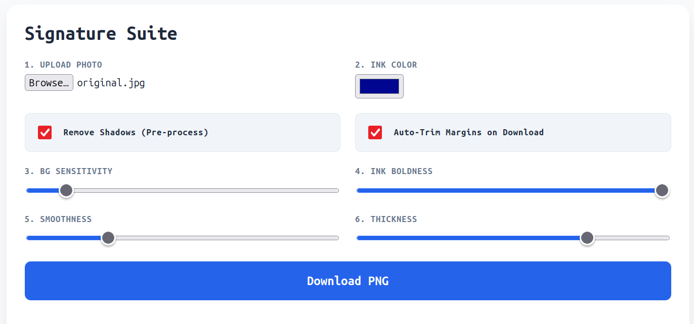
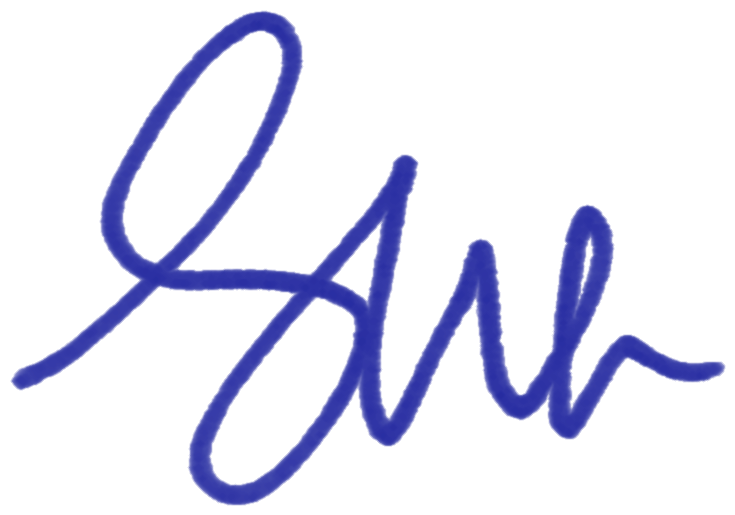
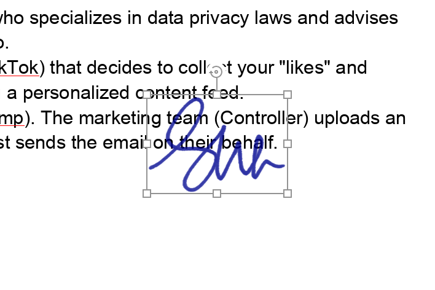

# Signature Smoother 🖋️

A lightweight, 100% client-side web application to convert photos of signatures into clean, transparent, and professional PNGs. No data is ever uploaded to a server—all processing happens right in your browser.

**[Link to Live App](https://signature.evilsna.me/)**

---

## 🌟 Features

 

* **Shadow Removal:** Adaptive pre-processing to flatten uneven lighting and "crush" paper shadows.
* **Real-Time Controls:** Adjust background sensitivity, ink boldness, and line thickness with instant visual feedback.
* **Smoothness Pass:** Applies a box-blur algorithm to remove pixelation and jagged edges from mobile photos.
* **Auto-Trim:** Automatically crops the final image to the bounding box of your signature on download.
* **Privacy First:** Zero server-side code. Your signature stays on your machine.

---

## 📸 Examples

| Original Photo | Processed Signature |
| :--- | :--- |
|  |  |

> **Tip:** For best results, take your photo in bright, even lighting using a dark felt-tip pen.

---

## 🚀 Usage

1.  Open the [Static Webpage](https://signature.evilsna.me/).
2.  Upload a JPG or PNG of your signature.
3.  (Optional) Check **"Remove Shadows"** if your photo has dark corners or uneven light.
4.  Adjust **Sensitivity** to clear the background and **Boldness** to make the ink solid.
5.  Use **Smoothness** to give it a "scanned" look.
6.  Click **Download Perfect PNG** to get your cropped, transparent signature.

---

## 🛠️ Technical Details

This app is built with vanilla JavaScript using the HTML5 Canvas API.

* **Shadow Removal:** Uses a local neighborhood maximum sampling to estimate background brightness and normalize the pixel values.
* **Boldness:** Implements a power-law transformation (Gamma correction) on the alpha channel to push semi-transparent grays toward 100% opacity.
* **Dilation:** A multi-pass 8-neighbor dilation algorithm for increasing line thickness.
* **Auto-Trim:** Scans the alpha-channel buffer to calculate the minimum and maximum coordinates of non-transparent pixels.

---

## 📄 License

MIT License - Feel free to use and modify for your own projects!
